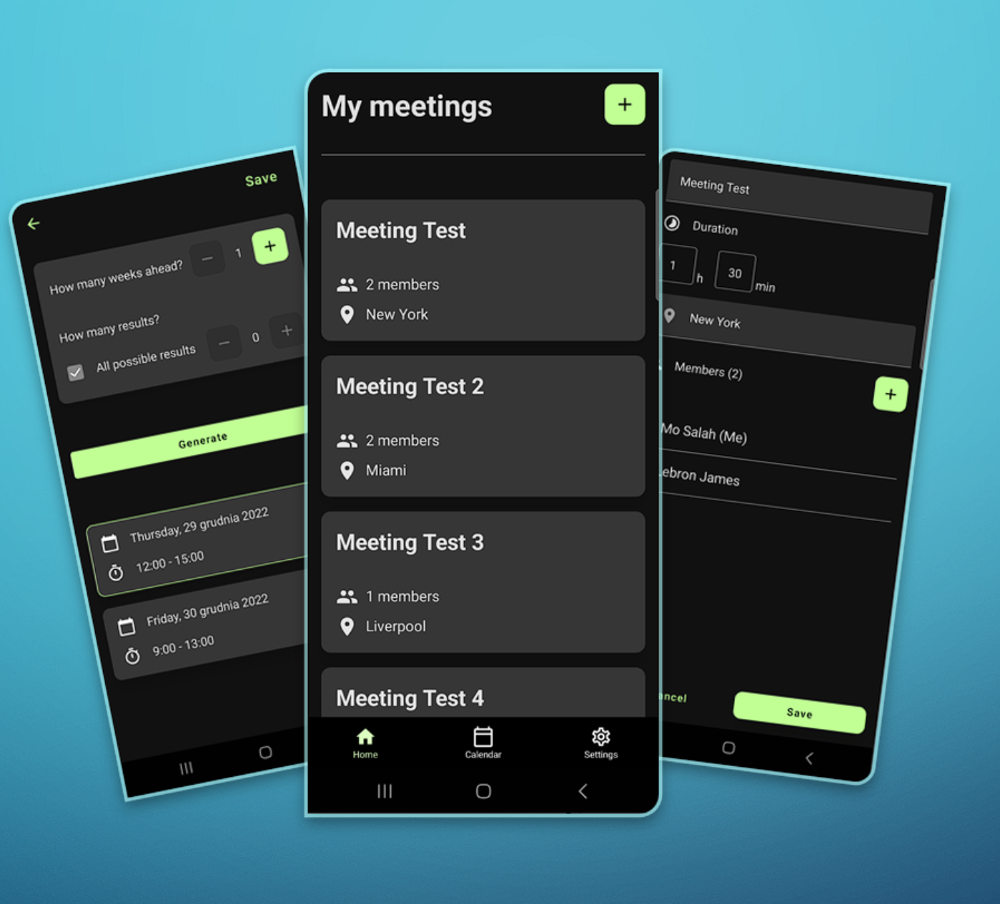
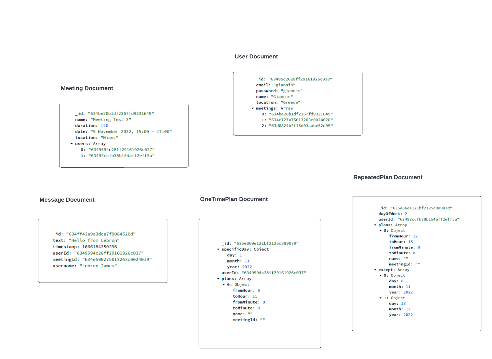

# Meeting App

As part of a 6-month school project, I've built a full stack mobile application that uses a meeting scheduling algorithm to find empty time slots in users calendars and schedule meetings for them. The app was built for the Android system using Kotlin and Jetpack Compose. The backend was built using Kotlin server-side framework - Ktor. It is connected to a cloud MongoDB database.

## Tech stack

Android, Kotlin, Ktor, MongoDB
## Screenshots

## Database schema

## Features

- JWT Authentication
- Defining plans in the calendar
- Meeting scheduling algorithm
- Inviting other users to meetings

